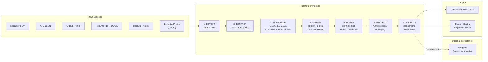
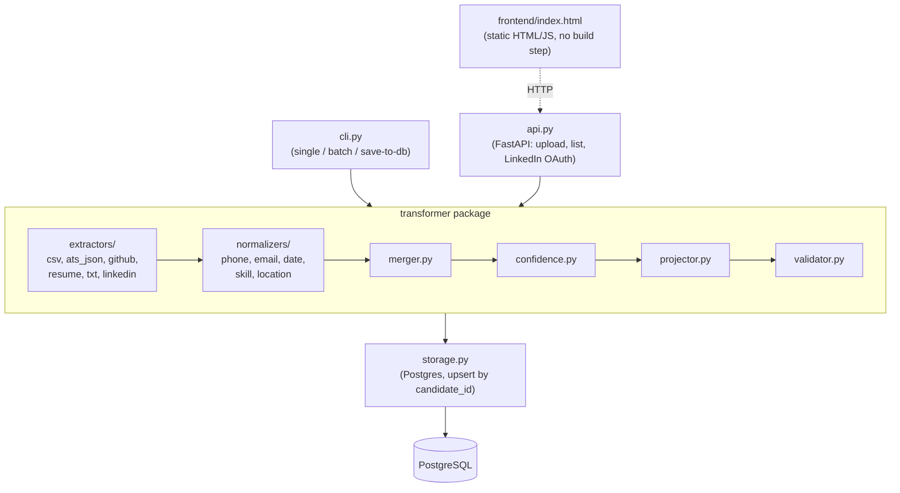
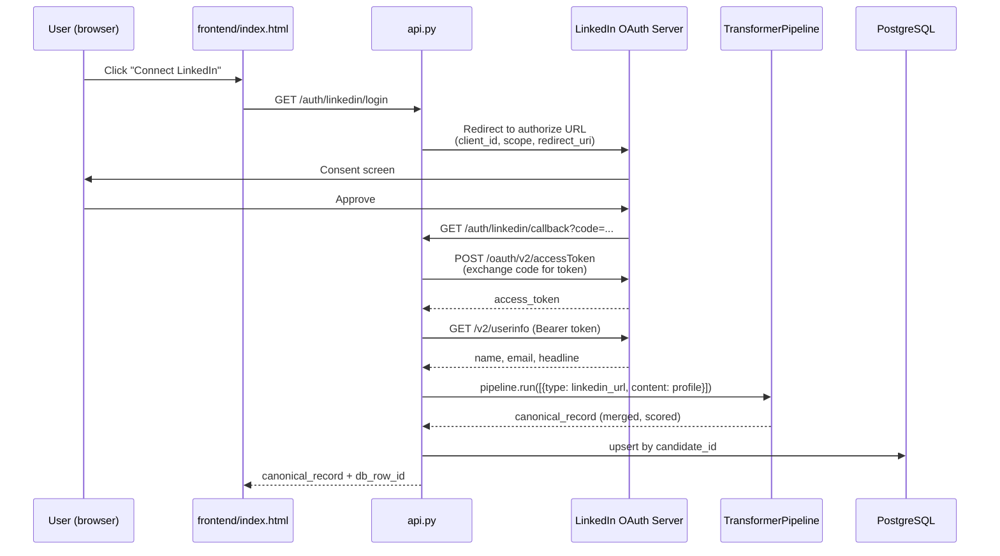
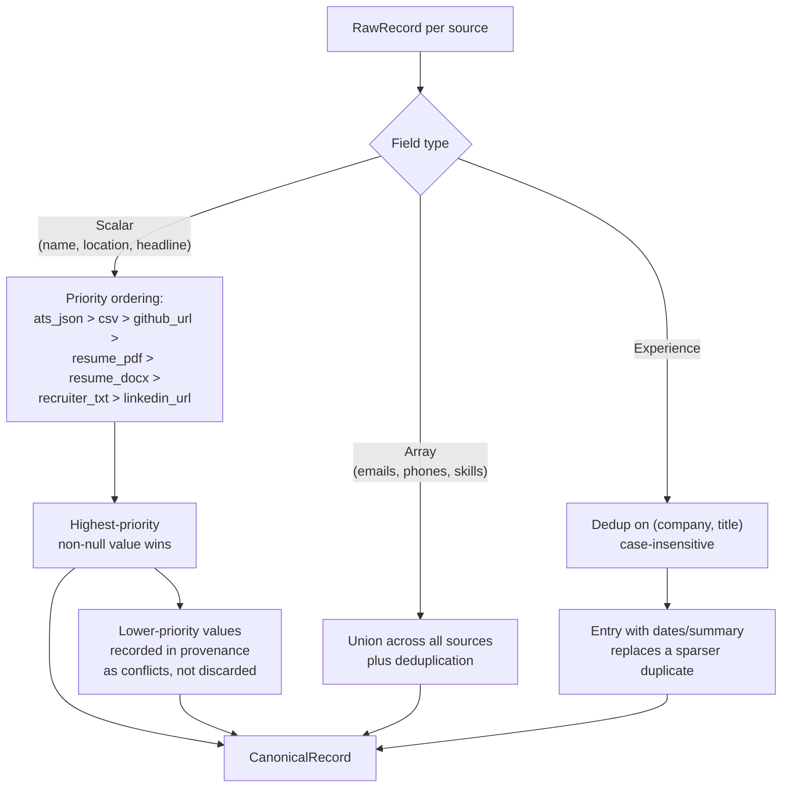
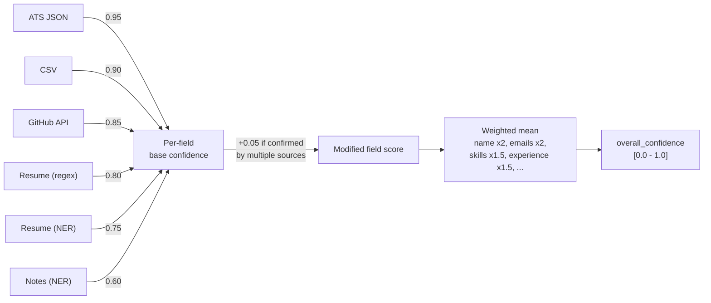

# Multi-Source Candidate Data Transformer

Transforms candidate data scattered across recruiter spreadsheets, ATS exports, GitHub
profiles, resumes, recruiter notes, and LinkedIn into a single canonical profile per
candidate, with every field traceable to its source and scored for confidence.

---

## 1. Problem Statement

A hiring pipeline accumulates information about the same candidate from several
independent systems, and these systems disagree with each other. A recruiter's CSV
might list a candidate's title as "Senior Engineer," the ATS as "Senior Software
Engineer II," and a resume as "Sr. SWE." Phone numbers arrive in a dozen formats.
Skills are spelled inconsistently ("JS," "Javascript," "ECMAScript"). Some sources
are structured and reliable; others are free text that has to be parsed.

Downstream systems — search, ranking, matching — cannot consume six divergent,
partially overlapping records. They need one canonical profile per candidate: fixed
schema, normalized values, deduplicated facts, and a clear record of where each value
came from and how much it can be trusted.

The transformer treats this as a data engineering problem rather than a scraping
problem. Every source is parsed independently into an intermediate representation,
merged under an explicit and auditable policy, scored for confidence, and only then
projected into whatever shape the caller actually needs.

A guiding constraint throughout: **an honest null is preferable to a confident
guess.** Hiring decisions downstream of this data are too consequential to risk
silently fabricated values. Where a field cannot be extracted reliably, it is left
empty and the gap is visible, not papered over.

---

## 2. Architecture

The pipeline runs as seven explicit stages. Each stage has a single responsibility
and a stable interface, so any stage can be modified, tested, or replaced without
touching the others.



**Why a staged pipeline rather than a single monolithic transform:** each stage is
independently testable in isolation (extraction logic has no knowledge of merge
policy; merge policy has no knowledge of output shaping), and new source types or
output formats can be added by extending exactly one stage. The 92-test suite tests
stages individually as well as end to end, which would not be possible with a single
opaque transform function.

### Component map



The CLI and the API are two thin entry points over the same `TransformerPipeline`.
Neither contains business logic of its own — they collect inputs, call
`pipeline.run()`, and decide what to do with the result (print, write to disk,
return as JSON, persist). This means CLI behavior and API behavior cannot drift
apart, and the pipeline itself is exercised identically regardless of how it is
invoked.

### LinkedIn OAuth integration

LinkedIn is not treated as a static file upload like the other sources — it is a
live OAuth 2.0 integration, fetched at request time rather than parsed from a file.



This is the same `TransformerPipeline` and the same `linkedin_extractor.py` /
`merger.py` / `confidence.py` path used by every other source — LinkedIn data is
not handled as a special case once it reaches the pipeline, only the acquisition
step (OAuth instead of file upload) differs.

---

## 3. Source Types

| Source | Category | What is extracted | Method |
|---|---|---|---|
| Recruiter CSV | Structured | Name, email, phone, company, title, location, skills | Column mapping |
| ATS JSON export | Structured | All fields via configurable field map | JSON path mapping, handles non-standard key names |
| GitHub profile URL | Semi-structured | Name, bio, location, email, top languages from public repos | GitHub REST API v3 |
| Resume (PDF / DOCX) | Unstructured | Name, contact info, skills, experience, education | spaCy NER + regex + section parsing; falls back to OCR (Tesseract) when a PDF page yields no extractable text |
| Recruiter notes (.txt) | Unstructured | Contact info, skills, free-text signals | Regex + keyword matching |
| LinkedIn profile (OAuth) | Semi-structured | Name, email, photo, headline (scope-dependent) | OAuth 2.0 authorization-code flow against LinkedIn's OpenID Connect product |

A single run accepts any combination of these. No source is mandatory and no
combination is required to produce output — an empty or partially-failed source is
logged as a warning, not treated as a fatal error.

---

## 4. Merge and Conflict Resolution

Records from each source are reduced into a single canonical record under one
explicit policy, applied per field type.



**Scalars use priority, arrays use union, by design.** A candidate has exactly one
name and one current headline — picking a single deterministic winner is correct.
A candidate has potentially several real emails or skills, each contributed by a
different source; discarding any of them would discard genuine signal. Treating
both field families the same way would either lose real data (forcing arrays
through priority selection) or produce an unauditable result (allowing scalars to
become arrays of conflicting values).

**Source priority is ordered by reliability, not arrival order:** an ATS export is
typically maintained by HR systems with validation; a recruiter's free-text note is
the least structured and most error-prone input. LinkedIn sits last in priority
because, given the OAuth scopes available to a self-serve developer app, it
contributes only identity-confirmation fields (name, email, headline) rather than
substantive profile data — it corroborates other sources rather than leading them.

---

## 5. Identity Resolution Across Submissions

A candidate is rarely submitted once. The same person might first appear through a
LinkedIn login today and through a resume upload next week. The transformer treats
these as the same candidate, not two separate ones, whenever they share an
identifying signal.

`candidate_id` is a deterministic hash of `email + name`, computed at merge time.
Two independent submissions for the same person therefore resolve to the same ID
without any external lookup or stored state. When persistence is enabled, the
storage layer uses this ID to **upsert** rather than insert: if a row already exists
for that `candidate_id`, the new submission is merged into the existing canonical
record using the same priority/union rules described above, and confidence is
recomputed over the merged result. If no row exists, a new one is created.

This makes repeated submissions additive rather than duplicative — a profile
accumulated by LinkedIn login, then resume upload, then a recruiter's CSV ends up as
one increasingly complete record, not three partial ones competing for attention in
a candidate list.

**Known limitation:** identity resolution depends on a shared email or name across
submissions. Two submissions for the same person under genuinely different emails,
with no other overlapping field, will not be automatically unified. Closing this gap
would require a fuzzy identity-resolution step (name similarity, phone matching) that
was judged out of scope for this assignment's surface area.

---

## 6. Confidence Scoring



Each field's confidence is derived from the reliability of the source it came from
and the extraction method used (a direct field copy from structured JSON is more
trustworthy than a regex match against free text). A field confirmed identically by
two or more independent sources receives a small upward adjustment, since
cross-source agreement is itself evidence of correctness. A field with no value
scores zero rather than being assigned a default — confidence is never assumed.

`overall_confidence` is a weighted mean across all fields, not a simple average:
identity fields (name, email) and substantive fields (skills, experience) carry more
weight than secondary fields (headline, years of experience), reflecting how much
each field actually matters to a hiring decision.

---

## 7. Configurable Output Layer

The canonical record (complete, internal) and the output a caller actually receives
(shaped by a runtime config) are kept strictly separate. The same pipeline run can
serve a full default schema to one caller and a narrow custom projection to another,
without re-running extraction or merge.

```json
{
  "fields": [
    { "path": "full_name", "type": "string", "required": true },
    { "path": "primary_email", "from": "emails[0]", "type": "string", "required": true },
    { "path": "phone", "from": "phones[0]", "type": "string", "normalize": "E164" },
    { "path": "top_skills", "from": "skills[].name", "type": "string[]", "normalize": "canonical" }
  ],
  "include_confidence": true,
  "on_missing": "null"
}
```

| Capability | Mechanism |
|---|---|
| Select a subset of fields | List only the desired fields in `"fields"` |
| Rename or remap a field | `"from"` resolves dot-notation and array-index paths |
| Per-field normalization | `"normalize": "E164"`, `"canonical"`, or `"lowercase"` |
| Toggle provenance and confidence | `"include_confidence": true / false` |
| Missing-value policy | `"on_missing": "null"`, `"omit"`, or `"error"` — even `"error"` returns a structured error list rather than raising an exception |

This separation means adding a new output consumer with different field
requirements never requires touching extraction, merge, or scoring logic — only a
new config file.

---

## 8. Persistence and Batch Processing

**Storage.** When `--save-to-db` (CLI) or `save_to_db` (API) is set, the canonical
record is written to PostgreSQL as a JSONB document keyed by `candidate_id`, with
the upsert-and-merge behavior described in Section 5. Storage is optional and the
pipeline is otherwise stateless — JSON output is always returned regardless of
whether persistence is enabled, so the transformer remains usable as a pure function
in contexts where a database is not available or desired.

**Batch mode.** `--batch <folder>` processes every candidate subfolder under a
directory sequentially through the same pipeline, writing a per-candidate output
file and a consolidated `batch_summary.json`. Batch processing is intentionally
sequential rather than parallelized across workers: the pipeline runs in roughly
3 milliseconds per candidate, so even several thousand candidates complete in
seconds without the operational complexity of worker pools, connection pooling, or
partial-failure coordination that parallelism would introduce for no measurable
benefit at this scale.

---

## 9. Web Interface and LinkedIn Integration

A minimal FastAPI service (`backend/api.py`) exposes the pipeline over HTTP:
`POST /transform` for multipart source uploads, `GET /candidates` and
`GET /candidates/{id}` for persisted records, and `GET /auth/linkedin/login` /
`GET /auth/linkedin/callback` for LinkedIn OAuth. A static HTML/JavaScript page
(`frontend/index.html`) consumes this API with no build tooling, framework, or
bundler — appropriate to the scope of an internal tool rather than a customer-facing
product.

**LinkedIn data, accurately scoped.** A self-serve LinkedIn developer app, using the
"Sign In with LinkedIn using OpenID Connect" product, can request only `openid`,
`profile`, and `email` scopes (`r_basicprofile`, where available, adds a headline).
This returns name, email, and headline — it does not return work experience,
education, or skills. Retrieving that data requires LinkedIn's Marketing Developer
Platform partnership, a separate business-approval process not available on a
standard developer account. The integration is built and functions correctly within
this boundary: LinkedIn is treated as an identity-confirmation source that
corroborates other sources, not as a primary data source, which is reflected in its
low position in the merge priority order (Section 4).

---

## 10. Tech Stack

| Layer | Technology | Rationale |
|---|---|---|
| Language | Python 3.10+ | Mature parsing, NLP, and data-validation ecosystem |
| Data models | Pydantic v2 | Strict typing with built-in validation and serialization |
| PDF extraction | pdfplumber | Reliable text extraction; per-page image rendering enables OCR fallback |
| OCR fallback | pytesseract + Tesseract | Recovers text from scanned/image-only resume pages without a poppler dependency |
| DOCX extraction | python-docx | Direct paragraph and table access |
| NLP | spaCy (`en_core_web_sm`) | Named-entity recognition for names in unstructured text; small model chosen for predictable latency over marginal accuracy gains from larger models |
| Phone normalization | phonenumbers | Industry-standard E.164 parsing across all locales |
| GitHub ingestion | requests + GitHub REST API v3 | Public profile and repository data, with rate-limit and 404 handling |
| LinkedIn integration | requests + OAuth 2.0 (authorization-code grant) | Standard, auditable OAuth flow against LinkedIn's official endpoints |
| Schema validation | jsonschema | Validates every output against its effective schema before returning |
| Storage | SQLAlchemy (Core) + PostgreSQL (psycopg2) | JSONB document storage with full SQL queryability; Core chosen over an ORM since the storage surface is three operations, not a full data-access layer |
| Web API | FastAPI + Uvicorn | Async-capable, typed request/response handling, automatic interactive docs |
| CLI | Click | Structured argument parsing, help generation, colored terminal output |
| Configuration | python-dotenv | Environment-based secret loading, never hardcoded |
| Tests | pytest | 92 tests across unit and integration layers |

---

## 11. Edge Cases and Handling

| Scenario | Handling |
|---|---|
| Same candidate across sources with conflicting field values | Highest-priority source wins for scalars; conflict recorded in provenance, not discarded |
| Phone number in an inconsistent format | Normalized to E.164; left null with a provenance note if unparseable |
| Same role present in CSV (no dates) and ATS export (with dates) | Deduplicated on (company, title); the entry with richer detail wins |
| GitHub profile returns 404 or hits a rate limit | Source skipped with a warning; one retry on rate-limit before skipping |
| ATS JSON using non-standard field names | Configurable field map in the ATS extractor; unmapped fields are ignored, not guessed |
| Scanned (image-only) resume PDF | OCR fallback via Tesseract recovers text where direct extraction yields none |
| All sources empty, missing, or malformed | Returns an empty canonical record with `overall_confidence: 0.0`; the pipeline does not raise |
| Same candidate submitted twice under different sources | Upserted into one record via identity resolution (Section 5), not duplicated |
| `on_missing: "error"` with a required field absent | Structured error returned in the response; never an unhandled exception |

---

## 12. Assumptions

- Each pipeline run processes one candidate; batch mode iterates this per-candidate
  unit across a folder rather than altering the per-candidate contract.
- GitHub and LinkedIn integrations are optional; the transformer functions fully
  with only file-based sources and no external API credentials.
- Identity resolution across submissions relies on an overlapping email or name;
  it is not a fuzzy-matching system.
- LinkedIn data is bounded by the OAuth scopes a self-serve developer account can
  obtain, as described in Section 9.

---

## 13. Project Structure

```
Eightfold.ai/
├── README.md
├── .env.example
├── docs/                              Planning documents (PRD, TRD, security, UX, implementation plan)
├── sample_output/                     Reference outputs against synthetic sample data
│
├── backend/
│   ├── cli.py                         CLI entry point (single, batch, save-to-db)
│   ├── api.py                         FastAPI service (transform, candidates, LinkedIn OAuth)
│   ├── requirements.txt
│   ├── scripts/
│   │   └── init_db.py                 Idempotent Postgres schema initialization
│   ├── data/
│   │   ├── skill_synonyms.json        Canonical skill name mappings
│   │   ├── country_codes.json         ISO-3166 country code mappings
│   │   └── samples/                   Synthetic sample inputs
│   ├── transformer/
│   │   ├── models.py                  Pydantic data models
│   │   ├── pipeline.py                Orchestrates the seven pipeline stages
│   │   ├── merger.py                  Merge, conflict resolution, cross-submission identity merge
│   │   ├── confidence.py              Confidence scoring
│   │   ├── projector.py               Runtime output projection
│   │   ├── validator.py               jsonschema output validation
│   │   ├── storage.py                 PostgreSQL persistence (upsert by candidate_id)
│   │   ├── extractors/                One module per source type, including linkedin_extractor.py
│   │   └── normalizers/               phone, email, date, skill, location
│   └── tests/                         92 tests across unit and integration layers
│
└── frontend/
    └── index.html                     Static HTML/JS client, no build step
```

---

## 14. Setup

```bash
# Clone and enter the project
git clone https://github.com/Mister2005/multi-source-candidate-transformer.git
cd multi-source-candidate-transformer

# Create and activate a virtual environment
python -m venv venv
venv\Scripts\activate          # Windows
# source venv/bin/activate     # macOS / Linux

# Install dependencies
cd backend
pip install -r requirements.txt
python -m spacy download en_core_web_sm

# Configure environment (project root, one level above backend/)
cd ..
copy .env.example .env         # cp on macOS / Linux
```

Edit `.env` and set whichever of the following you need:

```
GITHUB_TOKEN=              # optional — raises GitHub API rate limit from 60/hr to 5000/hr
LINKEDIN_CLIENT_ID=        # optional — required only for LinkedIn OAuth
LINKEDIN_CLIENT_SECRET=
LINKEDIN_SCOPES=openid profile email   # adjust to match what your LinkedIn app's product grants
DATABASE_URL=               # optional — required only for --save-to-db / the web UI's candidate list
```

If using Postgres, initialize the schema once:

```bash
cd backend
python scripts/init_db.py
```

If using LinkedIn OAuth, register this exact redirect URI in the LinkedIn app's
Auth settings before use:

```
http://localhost:8000/auth/linkedin/callback
```

---

## 15. Running

**Single candidate, CLI:**
```bash
cd backend
python cli.py --csv data/samples/recruiter.csv --ats-json data/samples/ats_export.json \
  --resume path/to/resume.pdf --notes data/samples/recruiter_notes.txt \
  --github https://github.com/username --output out.json
```

**With a custom output config:**
```bash
python cli.py --csv data/samples/recruiter.csv --config data/samples/output_config.json --output out.json
```

**With persistence:**
```bash
python cli.py --csv data/samples/recruiter.csv --ats-json data/samples/ats_export.json \
  --output out.json --save-to-db
```

**Batch mode** (a folder of `<candidate_name>/{data.csv, ats.json, resume.pdf, notes.txt}`):
```bash
python cli.py --batch path/to/batch_folder --save-to-db
```

**Web UI and API:**
```bash
cd backend
uvicorn api:app --reload --port 8000
```
Then open `frontend/index.html` directly in a browser (no separate server needed
for the frontend — it calls `http://localhost:8000` directly). The interactive API
documentation is available at `http://localhost:8000/docs`.

**Tests:**
```bash
cd backend
pytest tests/ -v
```
